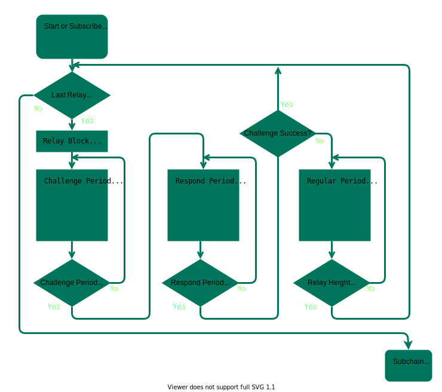

# User Guide

---

## Create Subchain

### Install

>The npm version `seele-anchor-cli` (abbreviated to "anc") requires: 6.13.0+.
>Install anc globally with `-g` tag to use everywhere.

```bash
npm i -g seele-anchor-cli
anc -v # --version: Show version
anc -h # --help: Show help
```

### Initiate

>Navigating between anc projects will not require terminal navigation in the future. For now, anc creates a `.subchain/yourProjectName` in user's current working directory (abbreviated to "cwd").
>Navigate to `yourProjectName` and open the directory with editor.

```bash
anc init -n mySubchain
```

### Start

>Configure [anc settings in conf.json](./2-conf.md).
>For private environment tools refer to [Developer resources](./1-test.md).

```bash
cd .subchain/mySubchain
anc fill      # Fill hashes
anc make -cd  # compile and deploy subchain to mainchain
anc show      # show results
```

---

## Interact with Subchain

> IMPORTANT: interacting with subchain for now requires user to

## Flow Chart summary



## User

Keys

```bash
anc keys -s 1 # --shard generate subchain and mainchain keypairs
anc keys -p   # return subchain and mainchain address by privatekey
```

Transact

```bash
anc send\
--to 0x55a03a606f8b1b9627c6e988806818fbc4544711\
--amount 100 # to and amount over subchain network
anc adtx\
--to 0x55a03a606f8b1b9627c6e988806818fbc4544711\
--amount 100 # to and amount over mainchain network
```

Trade

```bash
anc trade in  -a 100     # deposite money and
anc trade in  -a 100 -o  # deposite and request verifier privilege
anc trade out -a 100     # (TODO) exit money, keeping privilege
anc trade out -o         # cancel verifier privilege, refund all
anc trade fee -a 100     # (TODO) get all
anc trade                # show current status
anc trade out            # (TODO) early exits
```

Challenge

```bash
anc challenge --bond     #(TODO) challenge
```

## Verifier

Maintain

```bash
# config maintain info in conf.json
anc keep
anc keep -p #(TODO) push task to crontab
anc keep -d #(TODO) drop task from crontab
```

## Creator

Control

```bash
anc freeze    #(TODO) freeze subchain contract
anc unfreeze  #(TODO) unfreeze subchain contracts
```

---

[Developer resources](./1-test.md)
