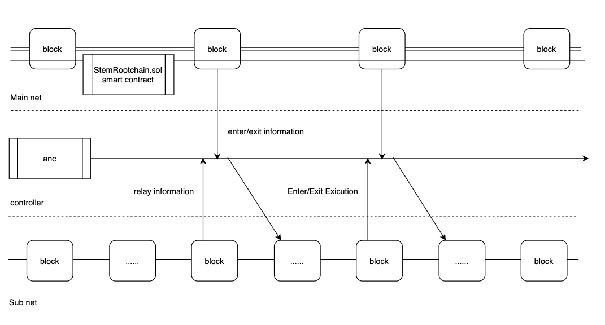
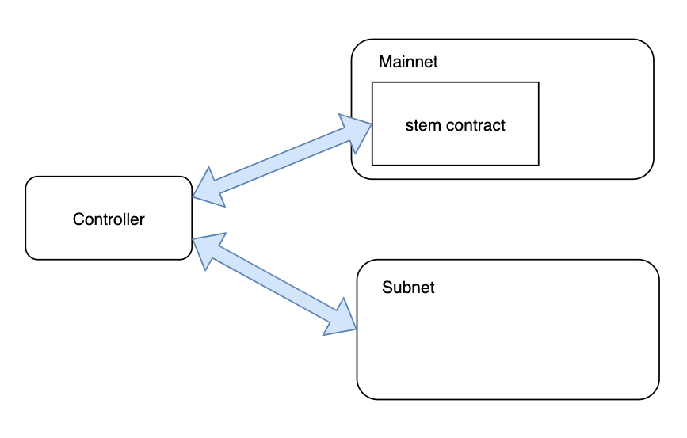

# Brief

STEM is Seele's take on subnet infrastructure. The protocol extends the security of the already fast Seele-Mainnet to supervise and credit an even faster Seele-Subnet. Subnets, powered by various token releasing mechanisms, supposedly assumes all the creative usages of a mainnet but faster.

# Parts

The main parts consist of a **contract**, ran on mainnet, and a **subnet**, ran similarly to the mainnet. To ease interaction, a **controller** that wraps interaction with the contract and subnet is developed.

Below are detailed and concise graphs illustrating the relationship between parts.

For more information on the integration of these parts, see [white paper](https://seele.pro/news/en/9.html) and the links below.

# Appendix

## Controler: seele-anchor-cli

[documentation](0-user.md)
  - [user](0-user.md)
  - [test](1-test.md)

[code](https://github.com/muyiy/seele-anchor-cli)

## go-seele-sub

[documentation](subchain_rpc.md)
  - [node api](subchain_rpc.md)
  - [node start](subchain_start.md)

[code](https://github.com/seeleteam/go-seele-sub)

## StemRootchain.sol

[documentation](subchain_contract.md)
  - [constructor](2-conf.md)
  - [contract](subchain_contract.md)

[code](https://github.com/muyiy/seele-anchor-cli/tree/master/src/sol)
